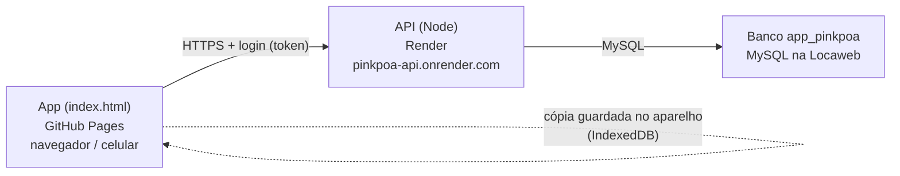

# Gestão Pink Poá — ERP

Sistema de gestão da **R.M. Fashion e Confecção** (marca Pink Poá): faturamento, comissões de
representantes, recebíveis, contas a pagar, conciliação bancária, vendas, estoques e compras.
Os dados vêm dos arquivos exportados do ERP Audience (CSV), de planilhas de e-commerce e do
extrato do Pagar.me.

- **Abrir o sistema:** https://miqueiasvenanciodecarvalho1-hub.github.io/pinkpoa-erp/
- **Versão atual:** aparece no topo e no rodapé (`v2.14.NNN`).

---

## 1. Como o sistema é montado

São três partes, cada uma num lugar:

| Parte | Onde fica | O que faz |
|---|---|---|
| **App** (`index.html`, este repositório, **público**) | GitHub Pages | Todas as telas, cálculos, importação dos arquivos, relatórios em PDF/Excel. É um arquivo HTML único. |
| **API** (repositório **privado** `pinkpoa-api`) | Render (serviço web Node) | Login, usuários e permissões, guarda e entrega os dados, preenche as tabelas do MySQL. |
| **Banco** `app_pinkpoa` | MySQL na Locaweb | Usuários, cópias dos dados do app e as tabelas de consulta (clientes, faturamento, recebíveis…). |

> **Regra de segurança:** este repositório é público. Aqui fica **somente** o `index.html`
> (e este README). Nunca colocar aqui o `server.js`, senhas, tokens, backups `.json` ou o `CLAUDE.md`.
> O HTML não contém dados da empresa nem senhas — os dados chegam pelo login.

---

## 2. Como funciona no dia a dia

### Entrar
1. Abra o link do sistema e entre com **e-mail e senha** (usuário criado pelo administrador).
2. No **primeiro acesso de todos** (banco sem nenhum usuário), a própria tela de login pede para
   **criar o administrador**.
3. O login vale **7 dias** no aparelho. **Sair** (menu) encerra a sessão e apaga os dados do aparelho.

### Carregar os dados
- Ao abrir, o app mostra **na hora** a última cópia guardada no aparelho e, em segundo plano,
  pergunta ao servidor se existe uma cópia mais nova. Se houver, baixa (compactada) e atualiza a tela.
- Sem internet ou com o servidor fora do ar, o app abre com a cópia do aparelho.
- A bolinha no topo (**⬤ API**) mostra a situação do servidor; clicar nela abre o painel **☁ Servidor**.

### Atualizar os dados (quem tem permissão de editar)
1. **Importação** → selecione a pasta/arquivos exportados do Audience (CSV), planilhas e extratos.
2. Confira as telas.
3. Clique na bolinha **⬤ API** → **☁ Salvar no servidor**. A partir daí todos os usuários recebem
   a cópia nova ao abrir o app.

### O que acontece no servidor ao salvar
- A cópia completa é guardada (o servidor mantém as **10 últimas** versões).
- Em seguida o servidor **preenche as tabelas do MySQL** (clientes, representantes, faturamento,
  comissões, recebíveis, duplicatas e movimentos bancários, naturezas, produtos, estoques, itens de
  venda, log de importação) para consulta direta no banco (Navicat etc.).
- **Duplicidade não entra no banco:** se uma chave se repete (ex.: o mesmo título/parcela duas
  vezes), nenhuma das ocorrências é gravada. A lista volta para o app em
  **☁ Servidor → Tabelas do MySQL → Ver duplicidades** (com botão **⬇ Baixar CSV**) para ser
  corrigida na origem e reimportada.

---

## 3. Usuários e acessos

- Menu **👥 Usuários e Acessos** (só administrador): criar, alterar, desativar usuários e definir,
  **para cada módulo**, *Sem acesso*, *Ver* ou *Editar*.
  - **Ver** — consulta, filtros, relatórios, PDF e Excel. Os botões de alterar/importar ficam
    travados e aparece a faixa "👁 Somente leitura".
  - **Editar** — também importa e altera; ao salvar no servidor, grava **apenas os módulos que pode
    editar** (o restante da cópia do servidor não muda).
- Módulos: Dashboard, Clientes, Representantes, Produtos, Faturamento, Comissões, Recebíveis,
  Contas a Pagar, Conciliação, Vendas, Estoques, Naturezas, Compras, Importação, Automação.
- O servidor entrega a cada usuário **só os dados dos módulos liberados**. Clientes, representantes
  e naturezas vão para todos como cadastro de referência (nomes nas telas).
- Usuário desativado perde o acesso imediatamente. Sempre existe pelo menos um administrador ativo.
- Cada usuário troca a própria senha em **🔑 Minha senha** (mínimo de 10 caracteres).

---

## 4. Configurações (administrador)

Menu **⚙️ Configurações**:
- **Servidor (Render):** tempo de resposta, há quanto tempo está acordado, MySQL, versão da API e memória.
- **Plano do servidor:** no plano **grátis** o Render "dorme" após 15 min sem uso (a primeira chamada
  espera até ~50 s). A tela traz o passo a passo e o botão para mudar para o plano **pago (Starter)**
  no site do Render, ou a alternativa grátis com o **UptimeRobot** chamando `/health` a cada 5 min.

---

## 5. Celular

O app é responsivo: menu lateral que abre pelo ☰, topo compacto (bolinha da API, compartilhar,
usuário), quadros de números em duas colunas e tabelas com rolagem lateral dentro do próprio quadro.
Pode ser adicionado à tela inicial do celular pelo navegador ("Adicionar à tela de início").

---

## 6. Publicar uma nova versão do app

O app é só o `index.html`. Publicar = substituir o arquivo neste repositório (branch `main`);
o GitHub Pages atualiza o site em 1–3 minutos (abrir com **Ctrl+F5**).

1. Editar o `index.html` com mudanças pontuais (o sistema é um arquivo único; não reescrever a arquitetura).
2. Subir a versão no rodapé: o texto do `` (`>v2.14.NNN`). O topo copia dele.
3. Validar: extrair o maior `<script>` e rodar `node --check`.
4. Commit com a mensagem `v 2.14.NNN — resumo` e push para `main`.

Sem ferramentas de desenvolvimento: o arquivo **`PUBLICAR_PINKPOA_1.bat`** (no computador do
administrador) pega o `GESTAO_PINKPOA_v*.html` mais recente da pasta Downloads, copia como
`index.html` e envia ao GitHub.

---

## 7. Arquivos de origem (importação)

| Arquivo | Conteúdo |
|---|---|
| `vpfatu1` / `vpfatu2` | Faturamento (notas fiscais) |
| `vp42541a` / `vp42541b` | Comissões dos representantes |
| `vpdpcl1` / `vpdpcl2` | Títulos a receber e seus movimentos (baixas, trocas) |
| `vpbanc3`, `vpdocx1` | Movimentos bancários e documentos de cobrança |
| `vprepr1`, `vpclie1` | Cadastro de representantes e de clientes |
| `vp0000` (planilha) | E-commerce |
| Extrato Pagar.me (`.xlsx`) | Cartão a receber |
| NF-e de compra (XML/PDF/planilha) | Compras e contas a pagar |

CSV do Audience: separador `;`, codificação Windows-1252.

---

## 8. Documentação técnica

- **API, banco, instalação do servidor, rotas e tabelas:** `README.md` do repositório privado `pinkpoa-api`.
- **Histórico completo, regras de negócio e decisões:** `CLAUDE.md` (fica fora dos repositórios,
  na pasta `C:\PINKPOA` do administrador).
